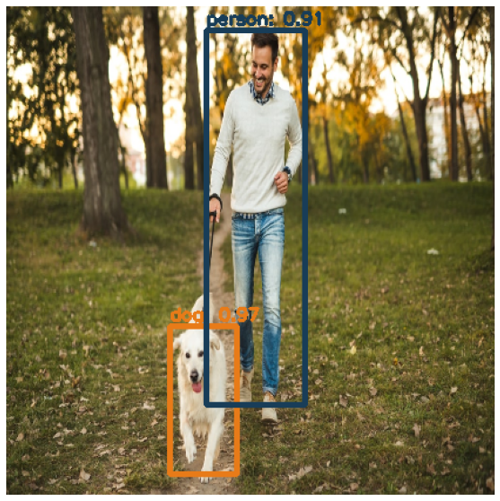

# README #

Object Detection in Python using **Yolo Tiny v3** Pytorch implementation.
      
The adopted Yolo architecture can be found under **src/yolo** or [here](https://pjreddie.com/darknet/yolo/).   

### How to Setup Yolo ###

    cd bash
    ./setup.sh

### How to Run ###

    python3 yolo_detector.py -i [imagePath] -c [confidence] -o [overlap] -O [outputPath] -C [cuda] -h [help]

*	-i: image path.
*	-c: confidence parameter (float).
*	-o: overlap parameter (float).
*	-O: output path (optional).
*	-C: use Cuda.
*	-h: it prompts help menu.

### Detection Example ###

  